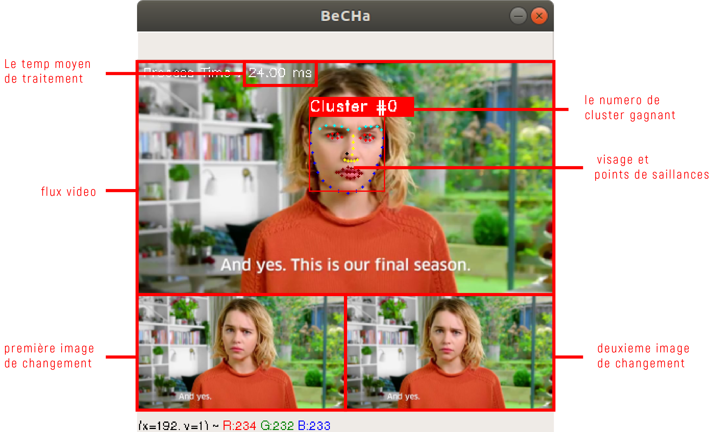
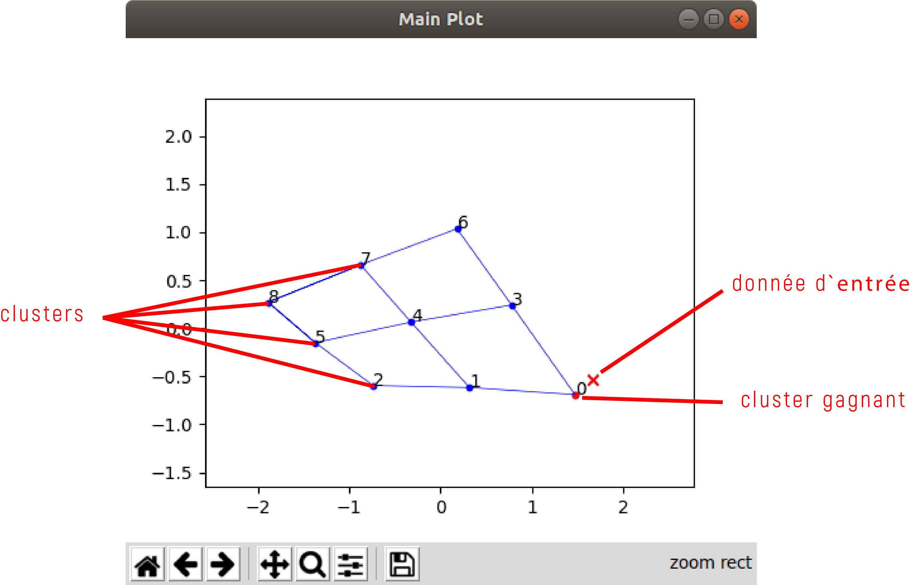
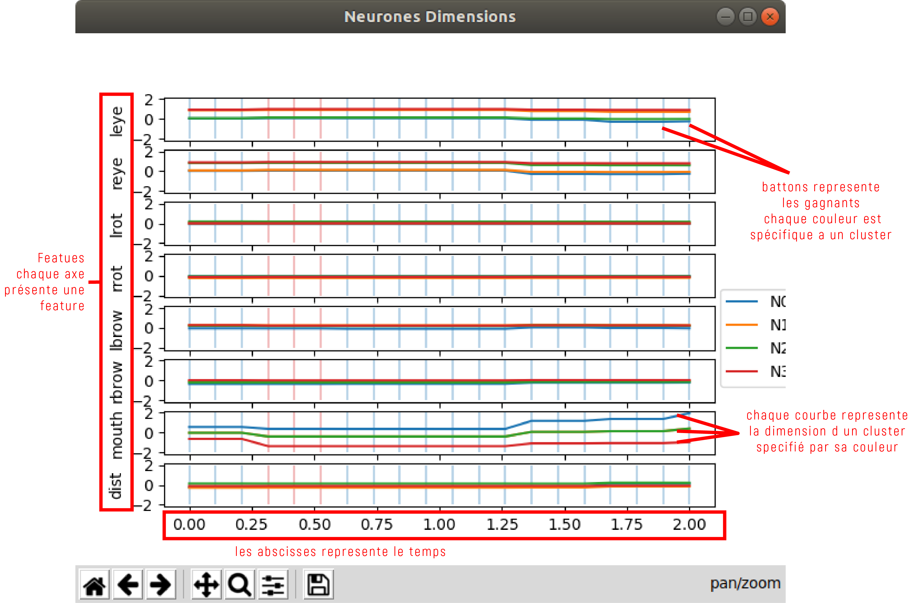
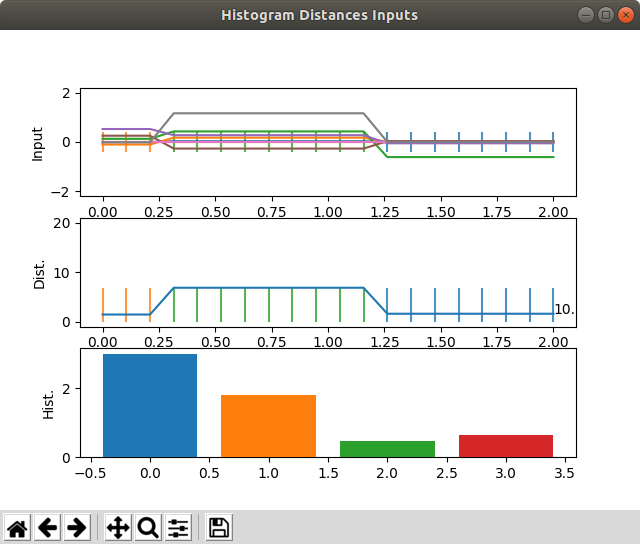

# suivi de visage et détection de saillance
ce projet présente un système qui permet de détecter des visages sur un flux video
et d'extraire par la suite des caracteristiques pour les classifier en 9 comportements

## dépendances 
vous devez installer les packages python 3 suivants
- numpy (1.16.2)
- matplotlib (3.0.3)
- sklearn (0.20.3)
- dlib (19.17.0)
- opencv-python (4.0.0)
- imutils (0.5.2)

vous pouvez les installer en utilisant pip \
`pip install <package-name>`

pour connaitre la version du package (par exmple dlib) \
```
import dlib
dlib.__version__
```

## Usage
```
usage: video_main.py [-h] [-v VIDEO] [-c CAMERA] [-f FILE] [-e ELASTICITY]
                     [-im INITIAL_METHOD] [-lr LEARNING_RATE] [-sig SIGMA]
                     [-dt DELTA] [-s SPEED] [-r RANGE] [-pca PCA_SAMPLES]
                     [-n ORDER_N] [-d DISPLAY]

optional arguments:
  -h, --help            show this help message and exit
  -v VIDEO, --video VIDEO
                        chemin de la video

  -c CAMERA, --camera CAMERA
                        numero de la webcam

  -f FILE, --file FILE  
                        chemin dans lequel on sauvgarde le fichier de plotting

  -e ELASTICITY, --elasticity ELASTICITY
                        elasticity de la DSOM

  -im INITIAL_METHOD, --initial-method INITIAL_METHOD
                        methode d'initialisation de la DSOM (regular, fixed or
                        random)

  -lr LEARNING_RATE, --learning-rate LEARNING_RATE
                        le taux d'apprentissage de la DSOM

  -sig SIGMA, --sigma SIGMA
                        le parametre sigma de la DSOM

  -dt DELTA, --delta DELTA
                        intervale du temps entres les images prises pour les
                        traitements

  -s SPEED, --speed SPEED
                        vitesse du plotting (1 = la vitesse maximale)

  -r RANGE, --range RANGE
                        taille de la plage de plotting

  -pca PCA_SAMPLES, --pca-samples PCA_SAMPLES
                        taille de la plage de l'ACP pour le plotting

  -n ORDER_N, --order-n ORDER_N
                        ordre de la map. ex: n = 3 implique que le nombre de
                        neurones n*n = 3*3 = 9

  -d DISPLAY, --display DISPLAY
                        les figres de plotting a afficher c'est une chaine de
                        trois bits XXX où chaque chiffre correspond à une
                        figure (1 pour afficher la figure et 0 pour ne pas
                        l'afficher)

```

## Plottings
#### Fenetre de flux video

#### Première figure : l'affichage 2D

#### Deuxième figure : les dimensions

#### Troisième figure : Les entrées, les distance et les clusters

